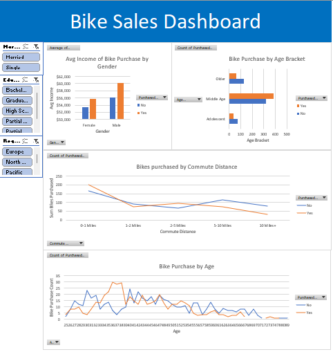
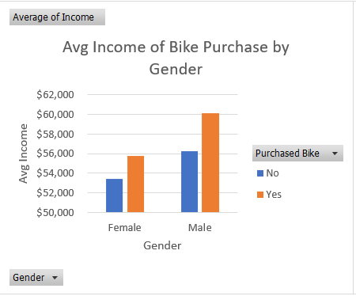
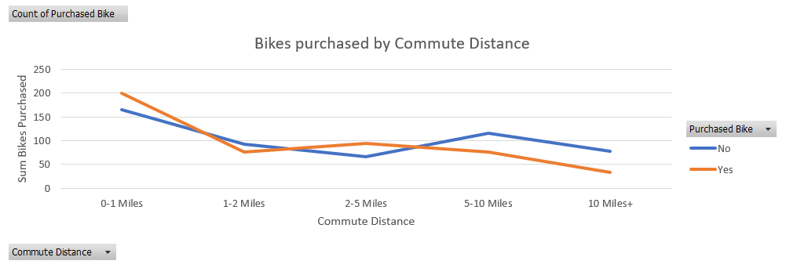

# Bike Sales Analysis – Interactive Excel Dashboard

## Project Overview

This project analyzes customer demographics for a fictional bike shop to identify factors that influence bike purchase decisions.
The goal was to clean and transform raw sales data in Microsoft Excel and build an interactive dashboard that helps stakeholders
understand key customer segments.

### Business Questions
- Does income level affect the likelihood of purchasing a bike?
- Does commute distance influence bike purchase decisions?
- How do marital status, education level, and region impact purchase behavior?

## Tools & Technologies
- Microsoft Excel (PivotTables, Pivot Charts, Slicers, nested IF statements, Find & Replace)

## Data Processing Workflow

### Data Loading
- Imported raw data from a public GitHub repository into Excel
- Organized the workbook into three dedicated sheets: **Working Data**, **Pivot Tables**, and **Dashboard** for clear separation of concerns

### Data Cleaning
- Removed 26 duplicate records
- Standardized categorical values (e.g., expanded marital status abbreviations from "M" to "Married")
- Formatted the Income column as currency with no decimal places for improved readability
- Created a new **Age Bracket** column using nested IF logic:
  - Adolescent: under 31
  - Middle Age: 31–54
  - Older: 55+

### Analysis & Visualization
Created multiple PivotTables and Pivot Charts focused on the binary purchase decision (Purchased Bike = Yes/No):

| Visualization | Purpose |
|---------------|---------|
| Average Income by Gender & Purchase Status | Explore income differences between buyers and non-buyers |
| Bike Purchases by Commute Distance | Analyze the relationship between commute length and purchase likelihood |
| Bike Purchases by Age Bracket | Segment customers by life stage |
| Bike Purchases by Age | Examine finer-grained age patterns |

### Interactive Dashboard
Built a single-page dashboard that consolidates the key visualizations. Interactive filters (Slicers) were added for:
- Marital Status (Married vs Single)
- Education Level
- Region

This allows stakeholders to dynamically explore how different demographic combinations affect purchase behavior.

## Key Findings

- Customers with higher average income were more likely to purchase a bike compared to lower-income groups.
- Commute distance showed a noticeable relationship with purchase behavior — customers with shorter commutes had higher purchase rates.
- Age bracket analysis indicated that the Middle Age group (31–54) had the strongest purchase activity.
- Marital status, education level, and region also influenced purchase likelihood when filtered through the interactive slicers.

## Skills Demonstrated
- Data cleaning and standardization
- Feature engineering (Age Bracket creation)
- PivotTable and PivotChart development
- Interactive dashboard design with Slicers
- Structured workbook organization for maintainability

## Conclusion
This project demonstrates a complete Excel-based analytics workflow — from raw data ingestion and cleaning through interactive visualization.
The resulting dashboard provides stakeholders with an easy-to-use tool for exploring customer demographics and supporting data-driven decisions
around target marketing and inventory planning.

---

**Author:** Michael Kenealy  
**Tools:** Microsoft Excel  
**Project Type:** Data Cleaning, Exploratory Analysis & Dashboarding
